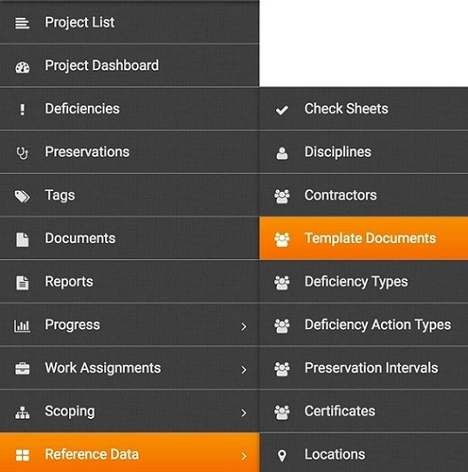
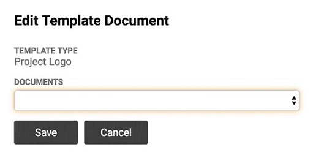

#Setting up a Project Logo

Project logos appear on the various reports in The Completions Tool. You may add or upate the project logo at any time. 

1. From the Menu, click **Menu > Documents**.  

2. Click **Add Document**.  

3.  Enter a **Name** and selet **Blank Check Sheet** from the **Document Type** drop-down list.

4. Drag and drop into the upload box or browse for the document. 
5. Click **Save**.
6. From the Menu, click **Menu > Reference Data > Template Documents**.

7. Click **Edit** next to Project Logo.
8. Select the logo uploaded in step 5.

7. Click **Save**.
 